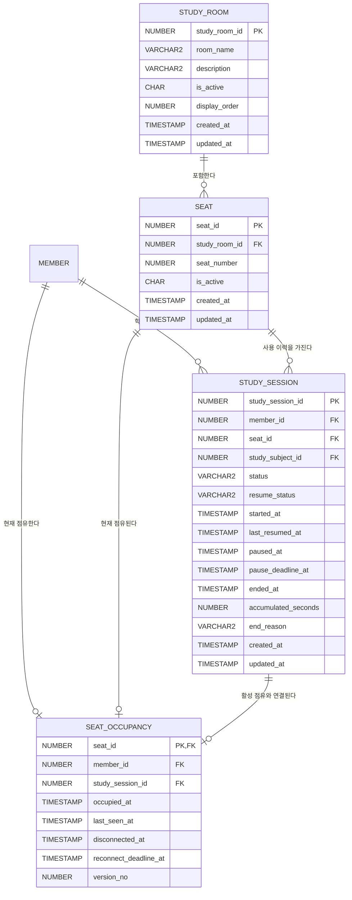

# 스터디 공간 모듈 ERD 초안

> 담당: 희주
>
> 상태: 팀 통합 검토 전 초안
>
> 범위: 스터디룸, 좌석, 현재 점유, 학습 세션
>
> 제외: 회원·캐릭터 상세 구조, 목표·투두, 학습 통계, 화면 좌표

## 1. 서비스와 모듈의 역할

공숲은 사용자가 시대별 캐릭터로 가상 스터디룸에 착석해 공부 시간을 기록하고,
한능검 문제은행·AI 해설·학습 통계를 함께 이용하는 학습 플랫폼이다.

스터디 공간 모듈은 다음 흐름을 담당한다.

```text
스터디룸 입장
→ 좌석 목록 및 점유 상태 조회
→ 빈 좌석 선택
→ 좌석 점유와 학습 세션 시작
→ 캐릭터·닉네임·현재 공부 정보 표시
→ 타이머 일시정지·재개
→ 사용자 퇴실 또는 정책에 따른 자동 퇴실
→ 학습 세션 종료 및 기록 보존
```

## 2. 현재까지 확정한 업무 규칙

### 좌석과 세션

- 회원 한 명은 동시에 하나의 좌석만 점유할 수 있다.
- 회원 한 명은 동시에 하나의 활성 학습 세션만 가질 수 있다.
- 좌석 하나는 동시에 한 명만 점유할 수 있다.
- 좌석 점유와 학습 세션 생성은 하나의 트랜잭션으로 처리한다.
- 일시정지 중에도 좌석 점유는 유지한다.
- 학습 세션 이력은 물리 삭제하지 않는다.
- 현재 점유 정보는 종료 시 제거하고, 과거 기록은 `study_session`에 보존한다.

### 타이머 일시정지

- 일시정지는 최대 1시간까지 가능하다.
- 일시정지 시 `pause_deadline_at = paused_at + 1시간`으로 계산한다.
- 1시간이 지나면 학습 세션을 자동 종료하고 좌석을 자동 해제한다.
- 화면에서는 만료 전에 경고를 제공한다. 경고 시점은 화면설계 후 확정한다.

### 브라우저 종료와 재접속

- 브라우저는 일정 주기로 서버에 heartbeat를 전송한다.
- heartbeat가 끊겨도 즉시 퇴실시키지 않고 10분간 좌석을 유지한다.
- 연결이 끊긴 시간은 공부 시간에 포함하지 않는다.
- 공부 시간은 마지막으로 확인된 `last_seen_at`까지만 인정한다.
- 10분 안에 재접속하면 기존 좌석과 학습 세션을 복구한다.
- 10분 안에 재접속하지 않으면 학습 세션을 자동 종료하고 좌석을 해제한다.
- 일시정지 만료와 재접속 만료가 동시에 걸려 있으면 먼저 도래한 만료 정책을 적용한다.

### 관리자

- 관리자는 스터디룸과 좌석을 활성화·비활성화할 수 있다.
- 점유 중인 좌석의 비활성화 정책은 팀 검토가 필요하다.
- 관리자 강제 퇴실 시 세션 종료 사유를 기록한다.

## 3. 상태 정의

### 학습 세션 상태

| 값 | 의미 |
| --- | --- |
| `RUNNING` | 타이머가 동작 중인 활성 세션 |
| `PAUSED` | 사용자가 타이머를 일시정지한 상태 |
| `DISCONNECTED` | heartbeat 중단으로 공부 시간 집계를 멈추고 재접속을 기다리는 상태 |
| `COMPLETED` | 사용자가 정상적으로 종료한 세션 |
| `AUTO_TERMINATED` | 일시정지 또는 재접속 제한시간 초과로 자동 종료된 세션 |
| `FORCED_TERMINATED` | 관리자가 강제로 종료한 세션 |

`DISCONNECTED` 진입 전 상태는 `resume_status`에 `RUNNING` 또는 `PAUSED`로 기록한다.
10분 안에 재접속하면 `resume_status`를 기준으로 원래 상태를 복구한다.

### 세션 종료 사유

| 값 | 의미 |
| --- | --- |
| `USER_EXIT` | 사용자가 정상 퇴실 |
| `PAUSE_TIMEOUT` | 일시정지 1시간 초과 |
| `RECONNECT_TIMEOUT` | 연결 종료 후 10분 동안 재접속하지 않음 |
| `ADMIN_FORCE_EXIT` | 관리자 강제 퇴실 |

## 4. 개념 ERD



`MEMBER`와 `study_subject_id`의 대상 테이블은 다른 모듈 소유이므로 팀 통합 ERD에서
실제 테이블명과 삭제 정책을 확정한다.

## 5. 테이블 정의 초안

### 5.1 `study_room`

공용 스터디룸의 기본 정보와 운영 상태를 관리한다. MVP가 공용룸 하나로 시작하더라도
관리자 확장성과 하드코딩 방지를 위해 테이블로 관리한다.

| 컬럼 | Oracle 타입 | NULL | 키·기본값 | 설명 |
| --- | --- | --- | --- | --- |
| `study_room_id` | `NUMBER(19)` | N | PK, `seq_study_room` | 스터디룸 식별자 |
| `room_name` | `VARCHAR2(100 CHAR)` | N |  | 화면 표시 이름 |
| `description` | `VARCHAR2(500 CHAR)` | Y |  | 방 설명 |
| `is_active` | `CHAR(1)` | N | 기본값 `Y`, CHECK | 운영 여부 `Y`·`N` |
| `display_order` | `NUMBER(10)` | N | 기본값 `0` | 화면 표시 순서 |
| `created_at` | `TIMESTAMP` | N |  | 생성 시각 |
| `updated_at` | `TIMESTAMP` | N |  | 수정 시각 |

제약조건 후보:

- `pk_study_room`: `study_room_id`
- `ck_study_room_active`: `is_active IN ('Y', 'N')`
- Sequence: `seq_study_room`

### 5.2 `seat`

스터디룸에 배치된 좌석을 관리한다. 좌석의 빈자리 여부는 `seat_occupancy` 존재 여부로
판단하며 `seat`에 점유 상태를 중복 저장하지 않는다.

| 컬럼 | Oracle 타입 | NULL | 키·기본값 | 설명 |
| --- | --- | --- | --- | --- |
| `seat_id` | `NUMBER(19)` | N | PK, `seq_seat` | 좌석 식별자 |
| `study_room_id` | `NUMBER(19)` | N | FK | 소속 스터디룸 |
| `seat_number` | `NUMBER(10)` | N | UNIQUE 조합 | 방 안에서 사용하는 좌석 번호 |
| `is_active` | `CHAR(1)` | N | 기본값 `Y`, CHECK | 관리자 사용 허용 여부 |
| `created_at` | `TIMESTAMP` | N |  | 생성 시각 |
| `updated_at` | `TIMESTAMP` | N |  | 수정 시각 |

제약조건 후보:

- `pk_seat`: `seat_id`
- `fk_seat_study_room`: `study_room_id → study_room.study_room_id`
- `uk_seat_room_number`: `(study_room_id, seat_number)`
- `ck_seat_active`: `is_active IN ('Y', 'N')`
- `idx_seat_study_room`: `study_room_id`
- Sequence: `seq_seat`

좌석의 화면 좌표·구역·방향은 화면설계 규칙을 받은 뒤 추가 여부를 결정한다.

### 5.3 `seat_occupancy`

현재 활성 상태인 좌석 점유 관계만 저장한다. 퇴실 시 행을 삭제하므로 과거 이력은
`study_session`에서 조회한다.

| 컬럼 | Oracle 타입 | NULL | 키·기본값 | 설명 |
| --- | --- | --- | --- | --- |
| `seat_id` | `NUMBER(19)` | N | PK, FK | 현재 점유된 좌석 |
| `member_id` | `NUMBER(19)` | N | FK, UNIQUE | 현재 착석한 회원 |
| `study_session_id` | `NUMBER(19)` | N | FK, UNIQUE | 현재 활성 학습 세션 |
| `occupied_at` | `TIMESTAMP` | N |  | 착석 시각 |
| `last_seen_at` | `TIMESTAMP` | N |  | 마지막 heartbeat 확인 시각 |
| `disconnected_at` | `TIMESTAMP` | Y |  | 연결 중단 판정 시각 |
| `reconnect_deadline_at` | `TIMESTAMP` | Y |  | 자동 퇴실 예정 시각 |
| `version_no` | `NUMBER(19)` | N | 기본값 `0` | 낙관적 잠금 버전 후보 |

제약조건 후보:

- `pk_seat_occupancy`: `seat_id`
- `fk_occupancy_seat`: `seat_id → seat.seat_id`
- `fk_occupancy_member`: `member_id → member.member_id` - 외부 모듈 협의
- `fk_occupancy_session`: `study_session_id → study_session.study_session_id`
- `uk_occupancy_member`: `member_id`
- `uk_occupancy_session`: `study_session_id`
- `idx_occupancy_deadline`: `reconnect_deadline_at`

`seat_id`를 PK로 사용하는 이유는 이 테이블이 이력 엔티티가 아니라 좌석당 최대 하나인
현재 관계이기 때문이다. 팀 공통 PK 정책 검토 시 인조키 방식과 비교한다.

### 5.4 `study_session`

한 번의 학습 시작부터 종료까지의 상태와 누적 공부 시간을 기록한다.

| 컬럼 | Oracle 타입 | NULL | 키·기본값 | 설명 |
| --- | --- | --- | --- | --- |
| `study_session_id` | `NUMBER(19)` | N | PK, `seq_study_session` | 학습 세션 식별자 |
| `member_id` | `NUMBER(19)` | N | FK | 학습한 회원 |
| `seat_id` | `NUMBER(19)` | N | FK | 사용한 좌석 |
| `study_subject_id` | `NUMBER(19)` | Y | FK 후보 | 공부 과목, 학습 모듈과 협의 |
| `status` | `VARCHAR2(20 CHAR)` | N | CHECK | 세션 상태 |
| `resume_status` | `VARCHAR2(20 CHAR)` | Y | CHECK | 연결 복구 시 돌아갈 상태 |
| `started_at` | `TIMESTAMP` | N |  | 세션 시작 시각 |
| `last_resumed_at` | `TIMESTAMP` | Y |  | 마지막 타이머 시작·재개 시각 |
| `paused_at` | `TIMESTAMP` | Y |  | 일시정지 시작 시각 |
| `pause_deadline_at` | `TIMESTAMP` | Y |  | 일시정지 자동 종료 예정 시각 |
| `ended_at` | `TIMESTAMP` | Y |  | 실제 종료 시각 |
| `accumulated_seconds` | `NUMBER(19)` | N | 기본값 `0`, CHECK | 확정된 누적 공부 초 |
| `end_reason` | `VARCHAR2(30 CHAR)` | Y | CHECK | 종료 사유 |
| `created_at` | `TIMESTAMP` | N |  | 생성 시각 |
| `updated_at` | `TIMESTAMP` | N |  | 수정 시각 |

제약조건 후보:

- `pk_study_session`: `study_session_id`
- `fk_session_member`: `member_id → member.member_id` - 외부 모듈 협의
- `fk_session_seat`: `seat_id → seat.seat_id`
- `ck_session_status`: 허용된 세션 상태만 저장
- `ck_session_resume_status`: `NULL`, `RUNNING`, `PAUSED`만 허용
- `ck_session_seconds`: `accumulated_seconds >= 0`
- `idx_session_member_started`: `(member_id, started_at)`
- `idx_session_pause_deadline`: `pause_deadline_at`
- Sequence: `seq_study_session`

활성 세션 중복 방지를 위한 Oracle 함수 기반 UNIQUE INDEX 후보:

```sql
CREATE UNIQUE INDEX uk_session_active_member
    ON study_session (
        CASE
            WHEN status IN ('RUNNING', 'PAUSED', 'DISCONNECTED')
            THEN member_id
        END
    );

CREATE UNIQUE INDEX uk_session_active_seat
    ON study_session (
        CASE
            WHEN status IN ('RUNNING', 'PAUSED', 'DISCONNECTED')
            THEN seat_id
        END
    );
```

위 SQL은 ERD 통합 후 이름과 상태값을 확정한 뒤 마이그레이션 파일로 작성한다.

## 6. 시간 계산 기준

DB에는 매초 증가하는 값을 저장하지 않는다. 상태 변경 시점에 서버에서 계산해
`accumulated_seconds`에 더한다.

```text
RUNNING 화면 표시 시간
= accumulated_seconds + (현재 서버 시각 - last_resumed_at)

PAUSED·DISCONNECTED·종료 상태 표시 시간
= accumulated_seconds
```

- 일시정지, 연결 중단, 정상 종료 직전에 경과 시간을 확정한다.
- 연결 중단 시 마지막 `last_seen_at`까지만 공부 시간으로 인정한다.
- 모든 시간 판정은 클라이언트 시각이 아니라 서버 시각을 사용한다.

## 7. 상태 전이

```text
착석
  → RUNNING

RUNNING
  → PAUSED             사용자가 일시정지
  → DISCONNECTED       heartbeat 중단
  → COMPLETED          사용자 퇴실
  → FORCED_TERMINATED  관리자 강제 퇴실

PAUSED
  → RUNNING            사용자가 재개
  → DISCONNECTED       heartbeat 중단
  → AUTO_TERMINATED    1시간 초과
  → COMPLETED          사용자 퇴실

DISCONNECTED
  → RUNNING 또는 PAUSED  10분 내 재접속
  → AUTO_TERMINATED      10분 초과 또는 기존 pause deadline 도래
```

## 8. 동시성 처리 초안

착석은 다음 순서로 하나의 트랜잭션에서 처리한다.

```text
1. seat 행을 비관적 잠금으로 조회
2. 좌석 활성 여부 확인
3. seat_occupancy에서 좌석의 기존 점유 확인
4. member_id의 기존 점유와 활성 세션 확인
5. study_session 생성
6. seat_occupancy 생성
7. Commit
```

- 동시 착석 충돌은 DB UNIQUE 제약조건으로 한 번 더 방어한다.
- 이미 점유된 좌석 또는 활성 세션 중복은 `409 Conflict`로 응답한다.
- 자동 종료 작업도 점유와 세션을 잠근 뒤 세션 종료·점유 삭제를 한 트랜잭션으로 처리한다.

## 9. heartbeat 및 자동 종료 초안

- heartbeat 전송 주기 후보: 30초
- 연결 중단 판정 후보: 마지막 heartbeat 후 60초
- 재접속 유예시간: 10분
- 일시정지 제한시간: 1시간
- 만료 세션 정리 작업은 서버 스케줄러가 주기적으로 수행한다.

30초·60초 값은 구현 전 팀과 화면 담당자가 확정한다. 탭이 백그라운드로 이동했을 때
브라우저 타이머가 지연되는 상황도 테스트한다.

## 10. 다른 모듈과의 경계

### 회원·캐릭터 모듈에서 조회

- `member_id`
- 닉네임
- 현재 선택한 캐릭터

좌석 또는 세션 테이블에 닉네임과 캐릭터 정보를 복사하지 않는다. 좌석 화면 응답을
만들 때 회원·캐릭터 모듈의 조회 결과를 조합한다.

### 학습 모듈에서 조회

- 공부 중인 과목
- 오늘의 목표
- 목표 시간
- 투두리스트 완료율

목표와 투두를 좌석 테이블에 저장하지 않는다. `study_subject_id`의 실제 참조 대상과
과목명 변경 시 이력 보존 방식은 학습 모듈 담당자와 협의한다.

### 통계 모듈에 제공

- 종료된 학습 세션의 누적 공부 시간
- 세션 시작·종료 시각
- 필요 시 공부 과목 식별자

## 11. API 후보

```text
GET    /api/v1/study-rooms
GET    /api/v1/study-rooms/{studyRoomId}/seats
POST   /api/v1/seats/{seatId}/occupancy
DELETE /api/v1/seats/{seatId}/occupancy
POST   /api/v1/study-sessions/{studySessionId}/pause
POST   /api/v1/study-sessions/{studySessionId}/resume
POST   /api/v1/study-sessions/{studySessionId}/heartbeat
GET    /api/v1/study-sessions/me/active

GET    /api/v1/admin/study-rooms
PATCH  /api/v1/admin/study-rooms/{studyRoomId}
PATCH  /api/v1/admin/seats/{seatId}
DELETE /api/v1/admin/seats/{seatId}/occupancy
```

업무 동작 API의 최종 형태는 팀 API 명세 통합 시 확정한다.

## 12. 팀 통합 시 확인할 사항

### 다른 모듈 ERD와 맞출 항목

- `member` 테이블과 PK의 실제 이름
- 공부 과목 테이블의 존재 여부와 실제 PK
- 회원 탈퇴 시 세션 이력의 FK 유지·익명화 정책
- 캐릭터 변경 시 좌석 화면에 현재 캐릭터를 표시할지 착석 당시 캐릭터를 표시할지
- 학습 통계에서 필요한 세션 컬럼
- 공통 `created_at`, `updated_at` 처리 방식
- Sequence `allocationSize`와 Oracle `CACHE` 값

### 스터디 공간 모듈에서 추가 결정할 항목

- 공용 스터디룸을 MVP에서 한 개만 운영할지 여러 개 허용할지
- 좌석 화면 배치를 DB 좌표로 관리할지 프론트 정적 배치로 관리할지
- 점유 중인 좌석을 관리자가 비활성화할 때 즉시 퇴실시킬지 예약 처리할지
- heartbeat 전송 및 연결 중단 판정 주기
- 일시정지 만료 전 경고 시점
- 관리자 강제 퇴실 사유를 별도 감사 테이블로 관리할지

## 13. ERD 통합 검수 체크리스트

- [ ] 테이블과 컬럼이 영문 snake_case인가?
- [ ] 테이블명이 단수형이고 Oracle 예약어를 피했는가?
- [ ] PK·FK가 `NUMBER(19)`와 Java `Long` 기준으로 통일됐는가?
- [ ] FK 컬럼명이 참조 대상 PK명과 동일한가?
- [ ] 모든 관계의 카디널리티와 삭제 정책이 표시됐는가?
- [ ] 업무상 중복을 막는 UNIQUE 제약조건이 있는가?
- [ ] Boolean 값이 `CHAR(1)`의 `Y`·`N`으로 설계됐는가?
- [ ] 이력 데이터가 물리 삭제되지 않는가?
- [ ] 제약조건명과 Sequence명이 공통 규칙에 맞는가?
- [ ] 이름이 가능한 한 30자 이내인가?
- [ ] 다른 모듈 데이터를 불필요하게 중복 저장하지 않았는가?
- [ ] 동시성 충돌을 DB 제약조건과 Lock으로 함께 방어하는가?
- [ ] Entity 관계에서 `@ManyToOne(fetch = LAZY)` 적용 대상을 확인했는가?
- [ ] ERD 확정 후 테이블 정의서와 마이그레이션 SQL을 함께 작성할 계획인가?
